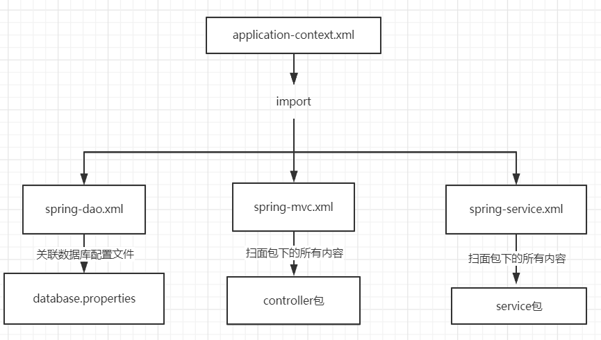

## 做一个web项目最基本的架子
### 零.前期准备
1. 导入maven的所有的依赖
2. 静态资源导出问题
3. 连接数据库,注意设置时间区域   
4. 创建包(controller, pojo, service, dao, utils)  
5. resources下面的各种配置文件的关系  
- database.properties:就是简单的数据库信息  
- mybatis-config.xml:mybatis的配置文件, Dao层每增加一个mapper接口就要写一个mapper.xml的配置文件,然后要在这个mybatis.xml的配置文件中引入.
- application-context.xml: Spring的顶配核心配置文件  
- spring-dao.xml:将dao层整合到spring中  
- spring-service.xml:将service层整合到spring中 
- spring-mvc.xml:mvc层也整合到spring中  

